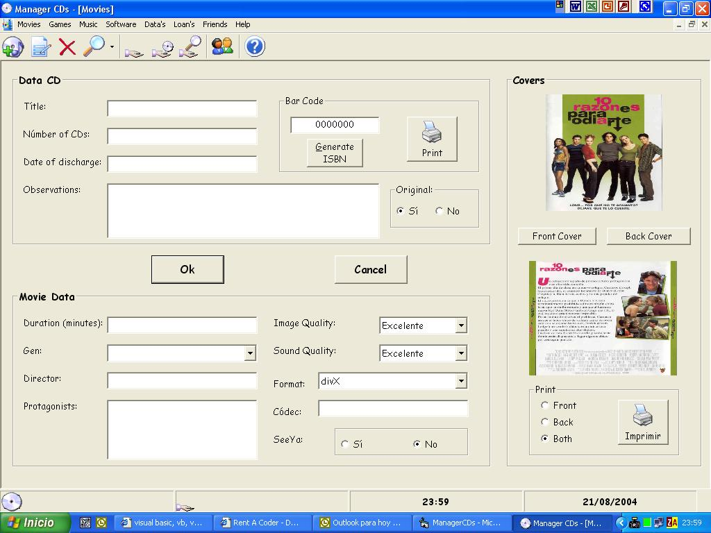

<div align="center">

## Manager Creator


</div>

### Description

The best example for beginner, of how can create a Management program. All line of this code are commented.You can use this program for video rental,or for your collections...Sorry bur can't upload this code...You can download it from www.piedrasrusticas.as.ro/Manager.zip Please rate it...
 
### More Info
 


<span>             |<span>
---                |---
**Submitted On**   |
**By**             |[firstbizsoft](https://github.com/Planet-Source-Code/PSCIndex/blob/master/ByAuthor/firstbizsoft.md)
**Level**          |Beginner
**User Rating**    |5.0 (30 globes from 6 users)
**Compatibility**  |VB 6\.0, VBA MS Access
**Category**       |[Complete Applications](https://github.com/Planet-Source-Code/PSCIndex/blob/master/ByCategory/complete-applications__1-27.md)
**World**          |[Visual Basic](https://github.com/Planet-Source-Code/PSCIndex/blob/master/ByWorld/visual-basic.md)
**Archive File**   |[](https://github.com/Planet-Source-Code/firstbizsoft-manager-creator__1-55732/archive/master.zip)


### Source Code

```
I can't upload this code. You can dowload it at:
www.piedrasrusticas.as.ro/Manager.zip
```

